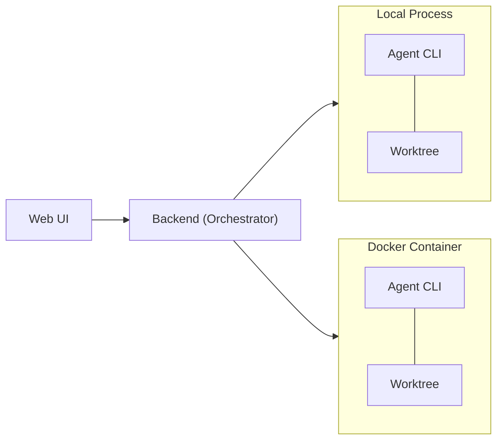

# Kandev

Manage and run tasks in parallel. Orchestrate agents. Review changes. Ship value.

[Workflows](docs/workflow-tips.md) | [Roadmap](docs/roadmap.md) | [Contributing](CONTRIBUTING.md) | [Architecture](docs/ARCHITECTURE.md) | [Discord](https://discord.gg/gWdCPGcFCD)

<p align="center">
  
</p>

[See all screenshots](docs/screenshots.md)

## What


Organize work across kanban and pipeline views with opinionated workflows and execute multiple tasks in parallel. Assign agents from any provider, and review their output in an integrated workspace - file editor, file tree, terminal, browser preview, and git changes in one place. Terminal agent TUIs are great for running agents, but reviewing and iterating on changes there doesn't scale.

Run it locally or self-host it on your own infrastructure and access it from anywhere via [Tailscale](https://tailscale.com/) or any VPN.

Open source, multi-provider, no telemetry, not tied to any cloud.

## Vision

> **Humans stay in control.** Define tasks, build agentic workflows with gates, review every change, decide what ships.

- **Review-first** - Humans support production systems. We need to understand (yet) and trust the code that gets deployed.
- **Your workflow** - Every team is different, and not every developer uses AI the same way. Define workflows once, share them across the team, and give everyone a consistent process for working with agents - regardless of experience level.
- **Remote agents** - Running multiple agents on a large codebase can quickly saturate a local machine. The goal is a single control plane: offload execution to servers, orchestrate from anywhere, including your phone.

## Features

- **Multi-agent support** - Claude Code, Codex, GitHub Copilot, Gemini CLI, Amp, Auggie, OpenCode
- **Parallel task execution** – start and manage multiple tasks from different sources simultaneously, boosting productivity with AI agents
- **Integrated workspace** - Built-in terminal, code editor with LSP, git changes panel, embedded vscode and chat in one IDE-like view
- **Kanban task management** - Drag-and-drop boards, columns, and workflow automation
- **Agentic workflows** - Multi-step pipelines that mix-and-match agents per step - for example, Claude Code Opus to design a plan, GitHub Copilot Sonnet to implement it, and Codex GPT 5.4 to review the changes. See [docs/workflows.md](docs/workflow-tips.md)
- **Sub-tasks** - Agents can spawn sub-tasks that resume from the parent task's session. Useful for splitting a task that has grown too big, or producing several PRs from the same starting point.
- **CLI passthrough** - Drop into raw agent CLI mode for direct terminal interaction with any supported agent, leverage the full power of their TUIs
- **Workspace isolation** - Git worktrees prevent concurrent agents from conflicting
- **Multi-repository tasks** - Span a single task across multiple repositories, with one worktree per repo, per-repo branches, per-repo PRs, and per-repo grouping in the Changes panel and review dialog
- **Flexible runtimes** - Run agents as local processes, in isolated Docker containers or in remote executors like sprites.dev
- **Session management** - Resume and review agent conversations
- **Stats** - Track your productivity with stats on the completed tasks, agent turns, etc

## Supported ACP Agents

| Agent | Protocol |
|:-------:|:----------:|
| **Claude Code** | ACP (`@zed-industries/claude-agent-acp`) |
| **Codex** | ACP (`@zed-industries/codex-acp`) |
| **GitHub Copilot** | ACP |
| **Gemini CLI** | ACP |
| **Amp** | ACP (`amp-acp`) |
| **Auggie** | ACP |
| **OpenCode** | ACP |

> All agents communicate via [ACP](https://agentclientprotocol.com) (Agent Client Protocol). Some agents support ACP natively, while others use ACP adapter packages that bridge their native protocols. **CLI Passthrough mode** is also available for direct terminal interaction with any agent CLI. If your agent isn't supported yet, open an issue or submit a PR with the integration. See [Adding a New Agent CLI](docs/add-agent-cli.md) for a step-by-step guide.

### Bring your own TUI agents

There is support for running any agent as TUI inside a terminal. Just add the cli command in the agent profile settings and the task will start the agent inside a PTY terminal instead of using ACP.

## Supported Executors

| Executor | Description |
|:--------:|-------------|
| **Local Process** | Runs the agent as a local process on the host machine |
| **Docker** | Runs the agent in an isolated Docker container |
| **Sprites** | Runs the agent in a remote cloud environment via [sprites.dev](https://sprites.dev) |

Each executor uses git worktrees for workspace isolation, preventing concurrent agents from conflicting.

## Quick Start

### NPX (recommended)

```bash
npx kandev
```

This downloads pre-built backend + frontend bundles and starts them locally. The worktrees and sqlite db will be created in `~/.kandev` by default. Should work on macOS, Linux, and Windows (WSL or native).

### From Source

```bash
# Clone the repository
git clone git@github.com:kdlbs/kandev.git
cd kandev

# Start in production mode
make start
```

**Prerequisites:** Go 1.26+, Node.js 18+, pnpm, Docker (optional - needed for container runtimes)

## High level architecture



We also want to add support for these remote runtimes:
- Remote SSH - run agents on remote servers over SSH, using docker or local processes with workspace isolation
- K8s operator - run agents in a Kubernetes cluster, with auto-scaling and resource management.

<details>
<summary><strong>Development</strong></summary>

### Project Structure

```
apps/
├── backend/    # Go backend (orchestrator, lifecycle, agentctl, WS gateway)
├── web/        # Next.js frontend (SSR, Zustand, real-time subscriptions)
├── cli/        # CLI tool (npx kandev launcher)
└── packages/   # Shared UI components & types
```

### Prerequisites

- Go 1.21+
- Node.js 18+
- pnpm
- Docker (optional)

### Running Dev Servers

```bash
# Start everything (backend + frontend with auto ports)
make dev

# Or run separately
make dev-backend    # Backend on :38429
make dev-web        # Frontend on :37429
```

### Testing & Linting

```bash
make test           # Run all tests (backend + web)
make lint           # Run all linters
make typecheck      # TypeScript type checking
make fmt            # Format all code
```

### Pre-commit Hooks

```bash
# Install pre-commit (https://pre-commit.com/#install)
pipx install pre-commit

# Install git hooks
pre-commit install
```

</details>

## Comparison to Other Tools

There are a few similar tools in this space, and new ones appearing everyday. Here's what sets this one apart:

- **Server-first architecture** - Not a desktop app. Runs as a server you can access from any device, including your phone. Start a task away from your computer and check in on it later.
- **Remote runtimes** - Run agents on remote servers and Docker hosts, not just your local machine.
- **Multi-provider** - Use Claude Code, Codex, Copilot, Gemini, Amp, Auggie, and OpenCode side by side. Not locked to one vendor.
- **CLI passthrough and chat** - Interact with agents through structured chat messages or drop into raw CLI mode for full agent TUI capabilities.
- **Open source and self-hostable** - No vendor lock-in, no telemetry, runs on your infrastructure.

## Contributing

Contributions are welcome! Please read [CONTRIBUTING.md](CONTRIBUTING.md) before opening a PR.

See the [issue tracker](https://github.com/kdlbs/kandev/issues) for open tasks, or join our [Discord](https://discord.gg/gWdCPGcFCD) to chat with maintainers and other contributors.

## Acknowledgments

Built with these excellent open-source projects:

[Monaco Editor](https://microsoft.github.io/monaco-editor/) · [Tiptap](https://tiptap.dev/) · [xterm.js](https://xtermjs.org/) · [dockview](https://dockview.dev/) · [CodeMirror](https://codemirror.net/) · [dnd-kit](https://dndkit.com/) · [Mermaid](https://mermaid.js.org/) · [Recharts](https://recharts.org/) · [TanStack Table](https://tanstack.com/table) · [Zustand](https://zustand.docs.pmnd.rs/) · [Shadcn/UI](https://ui.shadcn.com/) · [Radix UI](https://www.radix-ui.com/) · [Tailwind CSS](https://tailwindcss.com/)

## License

[AGPL-3.0](LICENSE)

## Star History

<a href="https://www.star-history.com/?repos=kdlbs%2Fkandev&type=date&legend=top-left">
 <picture>
   <source media="(prefers-color-scheme: dark)" srcset="https://api.star-history.com/chart?repos=kdlbs/kandev&type=date&theme=dark&legend=top-left" />
   <source media="(prefers-color-scheme: light)" srcset="https://api.star-history.com/chart?repos=kdlbs/kandev&type=date&legend=top-left" />
   
 </picture>
</a>
